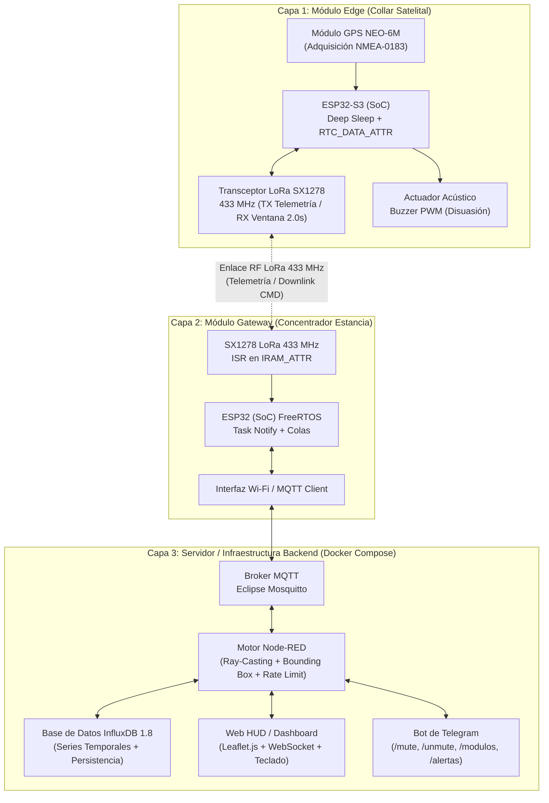
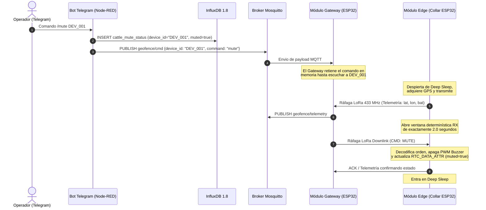

# Guía Integral de Preparación y Defensa: Sistema de Geofencing Ganadero IoT

> **Objetivo del Documento:** Proveer un guión estructurado, análisis técnico riguroso, diagramas de arquitectura y un banco de defensas ante preguntas críticas del jurado para la presentación universitaria / defensa de Trabajo Final.

---

## 1. Resumen Ejecutivo y Arquitectura del Sistema

El proyecto resuelve la problemática de monitoreo y contención de ganado en extensiones rurales desprovistas de cobertura celular (4G/5G) y alimentación eléctrica continua. Para ello, implementa una arquitectura descentralizada de tres capas que equilibra **bajo consumo energético en el borde** con **procesamiento y persistencia en tiempo real en el servidor**.

### Diagrama General de las Tres Capas



---

## 2. Guión Paso a Paso de la Presentación (Duración total estimada: ~14-16 minutos)

### Introducción y Planteo del Problema (2 minutos)
* **Puntos clave a decir:**
  - *"Buenos días a todos los miembros del jurado. Hoy presento el desarrollo e implementación de un sistema integral de Geofencing y Trazabilidad Ganadera basado en tecnologías IoT, LoRa y procesamiento en tiempo real."*
  - *"En la ganadería extensiva argentina y regional, el control del pastoreo enfrenta dos restricciones estructurales: la ausencia total de conectividad celular en los potreros y la imposibilidad de alimentar los collares desde la red eléctrica."*
  - *"Nuestra solución propone un collar autónomo de bajo costo que transmite posición satelital por radio LoRa en 433 MHz, un concentrador local de alta concurrencia, y una plataforma de monitoreo con alertas proactivas por Telegram y un actuador disuasorio acústico controlado de forma bidireccional."*

### Capa 1: Módulo Edge – Firmware, Autonomía y Ventana Determinística (4 minutos)
* **Puntos clave a decir:**
  - *"En el diseño del collar, la variable crítica es la autonomía. Un transceptor LoRa en recepción continua consume alrededor de 15 miliamperios, lo cual agotaría una celda de ion-litio en pocos días."*
  - *"Para superarlo, implementamos una máquina de estados finitos regida por el temporizador de reloj de tiempo real (RTC) del ESP32, reduciendo el consumo en modo Deep Sleep a microamperios."*
  - *"Para preservar el estado de operación (como si el zumbador está activado o silenciado) sin escribir en la memoria Flash —lo que causaría desgaste por ciclos y mayor latencia—, utilizamos la variable residente en memoria estática de bajo consumo mediante el atributo de compilador `RTC_DATA_ATTR`."*
  - *"Una innovación clave del collar es la comunicación bidireccional asincrónica: al finalizar cada transmisión de telemetría, el collar abre una **ventana de recepción determinística de exactamente 2.0 segundos**. Si no hay mandos pendientes desde el servidor, vuelve a Deep Sleep de inmediato."*

### Capa 2: Módulo Gateway – Concurrencia y Estabilidad en Tiempo Real (3 minutos)
* **Puntos clave a decir:**
  - *"El Módulo Gateway actúa como puente de protocolo entre el enlace RF LoRa de 433 MHz y la red IP/MQTT de la estancia."*
  - *"A nivel de sistemas embebidos, el desafío del Gateway es no perder paquetes por saturación cuando múltiples collares transmiten. Por ello, la interrupción de recepción (`DIO0`) fue emplazada en la memoria RAM dinámica mediante la directiva `IRAM_ATTR`."*
  - *"Dentro de la ISR, jamás realizamos operaciones pesadas o llamadas bloqueantes. Simplemente notificamos a una tarea consumidora de FreeRTOS mediante `vTaskNotifyGiveFromISR`, desacoplando la adquisición del hardware del envío por MQTT."*
  - *"Además, para garantizar una operación continua de meses sin reinicios, implementamos la desregistración explícita de manejadores de eventos (`esp_event_handler_unregister`) para prevenir fugas y fragmentación del heap."*

### Capa 3: Backend, Motor Algorítmico e Interfaces de Control (5 minutos)
* **Puntos clave a decir:**
  - *"En el servidor, todos los servicios se ejecutan en contenedores Docker (Mosquitto, InfluxDB y Node-RED). Al recibir un paquete MQTT, Node-RED inyecta una marca de tiempo canónica (`timestamp_ms` con `Date.now()`) para garantizar que la serie temporal en InfluxDB sea consistente y no dependa del reloj del microcontrolador."*
  - *"El corazón del sistema es el algoritmo de **Ray-Casting** para detectar si el animal está dentro o fuera del polígono virtual. Dado que calcular cruces sobre polígonos complejos para cientos de vacas puede ser costoso, incorporamos una optimización de **Caja Envolvente (Bounding Box)** en $\mathcal{O}(1)$: si el punto está fuera del rectángulo exterior, se descarta instantáneamente sin procesar los cruces del polígono."*
  - *"Si se confirma la salida (`inside === false`), el sistema activa una alerta por Telegram. Para evitar que un animal en el borde del cerco sature el chat de los operadores, diseñamos un mecanismo algebraico de **Rate Limiting** que impone un intervalo mínimo de 40 segundos entre notificaciones por collar."*
  - *"Finalmente, la interfaz web Leaflet.js se mantiene sincronizada al milisegundo mediante WebSocket (`/ws`) y permite ajustar con precisión micrométrica ($\Delta = \pm 0.0001^\circ$) los vértices del perímetro mediante las flechas del teclado, persistiendo la nueva geometría directamente en InfluxDB."*

---

## 3. Diagramas de Flujo Detallados para Diapositivas o Pizarra

### Flujo Transaccional Bidireccional de Control (`/mute` y `/unmute`)



### Algoritmo de Ray-Casting con Pre-filtro de Bounding Box en Node-RED

```mermaid
flowchart TD
    A[Ingreso de Coordenada GPS: lat, lon] --> B[Obtener Geocerca Activa y Caja Envolvente desde InfluxDB]
    B --> C{¿Está el punto dentro del<br/>Bounding Box min/max lat/lon?}
    
    C -- NO (Complejidad O(1)) --> D[Resultado Instantáneo: FUERA DEL CERCO]
    C -- SÍ --> E[Ejecutar Algoritmo Ray-Casting<br/>Teorema de la Curva de Jordan - O(N)]
    
    E --> F{¿El número de cruces con<br/>las aristas es IMPAR?}
    F -- SÍ --> G[Resultado: DENTRO DEL CERCO]
    F -- NO --> D
    
    D --> H{¿Estado silenciado por /mute<br/>o en Rate Limit < 40s?}
    H -- SÍ --> I[Omitir Notificación Telegram<br/>Registrar evento en base de datos]
    H -- NO --> J[Disparar Alerta Automática Telegram<br/>Actualizar Timestamp de Última Alerta]
```

---

## 4. Banco de Preguntas Difíciles del Jurado (`Grill-Me Prep`) y Respuestas Fundamentadas

### Categoría A: Arquitectura y Protocolos de Comunicación

#### 1. ¿Por qué utilizaron LoRa punto a punto (P2P) en 433 MHz con protocolo propietario en lugar de adoptar el estándar internacional LoRaWAN?
* **Respuesta técnica sólida:**
  > *"La elección de LoRa P2P en 433 MHz para esta fase del proyecto respondió a tres criterios ingenieriles decisivos:*
  > 1. **Latencia determinística y control en el borde:** LoRaWAN en Clase A requiere negociar ventanas de recepción cerradas por el Network Server, lo que complejiza el control exacto de mandos inmediatos en infraestructuras cerradas. Al implementar nuestro protocolo sobre el transceptor SX1278 con ventana determinística de 2.0s, logramos un acoplamiento directo y predecible entre el Gateway y el collar.
  > 2. **Costo de infraestructura y autonomía:** En potreros remotos sin internet por fibra o 4G, un Gateway P2P con ESP32 cuesta una fracción de un Gateway LoRaWAN multicanal comercial, y se integra de forma nativa a nuestra red LAN/MQTT local de la estancia.
  > 3. **Trabajo Futuro:** Como indicamos en las conclusiones, la evolución natural del sistema para escalabilidad multi-estancia es migrar a LoRaWAN Clase A, manteniendo intacta toda la lógica algorítmica y de backend desarrollada en Node-RED e InfluxDB."*

#### 2. ¿Por qué el cálculo del perímetro (Ray-Casting) se realiza en el servidor (Node-RED) y no localmente en el microcontrolador del collar?
* **Respuesta técnica sólida:**
  > *"Si bien el ESP32 tiene potencia de cálculo suficiente para ejecutar el algoritmo de Ray-Casting localmente, descentralizar este cálculo al servidor presenta ventajas estratégicas en ganadería:*
  > 1. **Flexibilidad operativa en tiempo real:** Si el productor ganadero modifica el cerco virtual desde el HUD web o por teclado, el cambio tiene efecto inmediato ($<10$ ms) en el servidor para todos los animales. Si el cálculo se hiciera en el collar, deberíamos transmitir por LoRa la lista completa de coordenadas de los nuevos vértices del polígono a cada uno de los cientos de collares, saturando el espectro radioeléctrico y gastando batería.
  > 2. **Minimización del payload LoRa:** Al transmitir únicamente la telemetría cruda (`lat`, `lon`, `bat`), mantenemos las tramas LoRa extremadamente cortas ($<30$ bytes), minimizando el tiempo en el aire (*Time-on-Air*), reduciendo la probabilidad de colisiones y ahorrando energía.
  > 3. **Evolución híbrida:** En el trabajo futuro proyectamos un modelo híbrido donde el collar almacene una caja envolvente simplificada para reducir transmisiones cuando está en el núcleo interior, pero la validación perimetral final siempre recae en el servidor."*

---

### Categoría B: Firmware, Sistemas Embebidos y Concurrencia

#### 3. ¿Por qué es tan crítico ubicar la rutina de atención de interrupción (ISR) en `IRAM_ATTR` en el ESP32 del Gateway? ¿Qué pasaría si no se hiciera?
* **Respuesta técnica sólida:**
  > *"En el ESP32, la memoria Flash externa se accede a través de un bus SPI y un caché de instrucciones. Cuando el procesador realiza una operación de escritura o borrado en Flash (o cuando el subsistema Wi-Fi/FreeRTOS accede a recursos sincronizados), el caché de Flash se deshabilita temporalmente.*
  > *Si el pin `DIO0` del módulo LoRa dispara una interrupción justo en ese momento y el código de la ISR se encuentra residente en la memoria Flash (por no tener el atributo `IRAM_ATTR`), la CPU sufre un **Cache Miss en ISR**, lo que provoca una excepción fatal (`Cache disabled but cached memory region accessed`) y el reinicio por Watchdog del Gateway.*
  > *Al forzar la residencia en RAM interna con `IRAM_ATTR` y limitarnos a hacer un `vTaskNotifyGiveFromISR` de orden $\mathcal{O}(1)$, garantizamos estabilidad y tiempo real estricto sin importar la carga del subsistema Wi-Fi o Flash."*

#### 4. ¿Cómo aseguran que el collar no pierda su configuración ni su estado de silencio (`muted`) durante el modo *Deep Sleep*?
* **Respuesta técnica sólida:**
  > *"Durante el modo `Deep Sleep` en el ESP32, se desconecta la alimentación de los núcleos principales de la CPU y de la mayor parte de la memoria SRAM para reducir el consumo al orden de $10 \mu\text{A}$. Sin embargo, el subsistema del Reloj de Tiempo Real (RTC Controller) y la memoria rápida y lenta del RTC permanecen alimentados.*
  > *Utilizando el modificador de almacenamiento `RTC_DATA_ATTR`, las estructuras de control que contienen los flags de estado (`is_muted`, contadores de ciclos y última coordenada conocida) se asignan directamente en esa memoria persistente de bajo consumo.*
  > *De esta forma, evitamos escribir en la memoria EEPROM/Flash interna en cada ciclo, lo cual no solo ahorraría tiempo de ejecución al despertar, sino que previene el desgaste físico de la Flash (que tiene un límite de $\sim 100,000$ ciclos de escritura)."*

---

### Categoría C: Backend, Base de Datos y Notificaciones

#### 5. ¿Qué ocurre si el contenedor de Node-RED o Docker se reinicia súbitamente? ¿Se pierde la geometría de la geocerca o las alertas silenciadas de los animales?
* **Respuesta técnica sólida:**
  > *"El sistema es completamente resistente a caídas y reinicios gracias al patrón de **Persistencia Enrutada en InfluxDB**:*
  > 1. **Geocerca persistente:** Cada vez que se actualiza el cerco por web (`/update-fence`), se guarda en la medición `geofence_config`. Al iniciarse Node-RED, el nodo de arranque (`once: true`) ejecuta una consulta `LAST()` sobre `geofence_config` y carga el polígono activo y su Bounding Box en la memoria global (`flow.get('current_fence')`).
  > 2. **Estado de silenciado persistente:** De igual modo, los comandos `/mute` y `/unmute` de Telegram escriben en `cattle_mute_status`. Si Node-RED se reinicia, el flujo consulta el último valor en InfluxDB antes de emitir un comando o decidir si disparar el zumbador, preservando el estado transaccional sin pérdida de sincronía."*

#### 6. ¿Cómo previene el bot de Telegram el bombardeo de mensajes si un animal se queda pastando justo en el límite de la geocerca entrando y saliendo en cada reporte?
* **Respuesta técnica sólida:**
  > *"Implementamos un mecanismo de **Rate Limiting por Estado y Temporización** en el flujo de Node-RED:*
  > *Cada vez que se detecta un evento de salida (`inside === false`), el sistema verifica en memoria global el sello de tiempo de la última notificación enviada para ese `device_id` específico. Si la diferencia temporal es menor a **40 segundos** (parámetro de ventana de guarda ajustable), el evento se registra silenciosamente en InfluxDB pero se descarta el envío del push HTTP a la API de Telegram.*
  > *Esto asegura que el operador reciba alertas tempranas y accionables sin sufrir fatiga de alarmas ni saturación de la interfaz de chat."*

---

## 5. Resumen de Métricas Clave para Defender en la Presentación

| Métrica / Parámetro | Valor Técnico Implementado | Justificación de Ingeniería |
| :--- | :--- | :--- |
| **Frecuencia de Radio** | 433 MHz (LoRa SX1278) | Mayor penetración en vegetación rural y alcance P2P que 2.4 GHz o Wi-Fi. |
| **Consumo en Deep Sleep** | $\sim 10\,\mu\text{A}$ | Maximiza la duración de la celda 18650 por meses de operación autónoma. |
| **Ventana RX Downlink** | $2.0\text{ segundos}$ exactos | Balance óptimo entre tiempo de respuesta para mandos (`/mute`) y ahorro energético. |
| **Latencia de Alerta** | $< 100\text{ ms}$ (Ingesta a Telegram) | Procesamiento no bloqueante por colas e inyección de marcas de tiempo en el servidor. |
| **Complejidad Pre-filtro** | $\mathcal{O}(1)$ (Bounding Box) | Descarte geométrico instantáneo antes del cálculo trigonométrico $\mathcal{O}(N)$ de Ray-Casting. |
| **Rate Limit Telegram** | 1 alerta por collar cada $40\text{ s}$ | Prevención de saturación de chat e inundación de notificaciones por oscilación de borde. |
